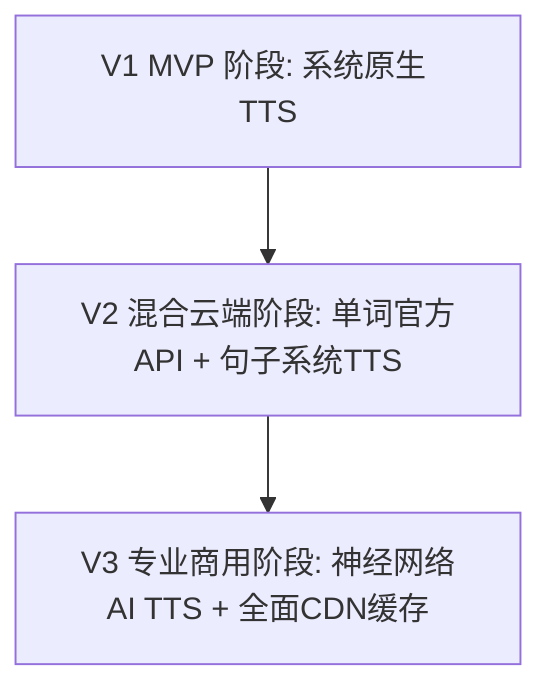
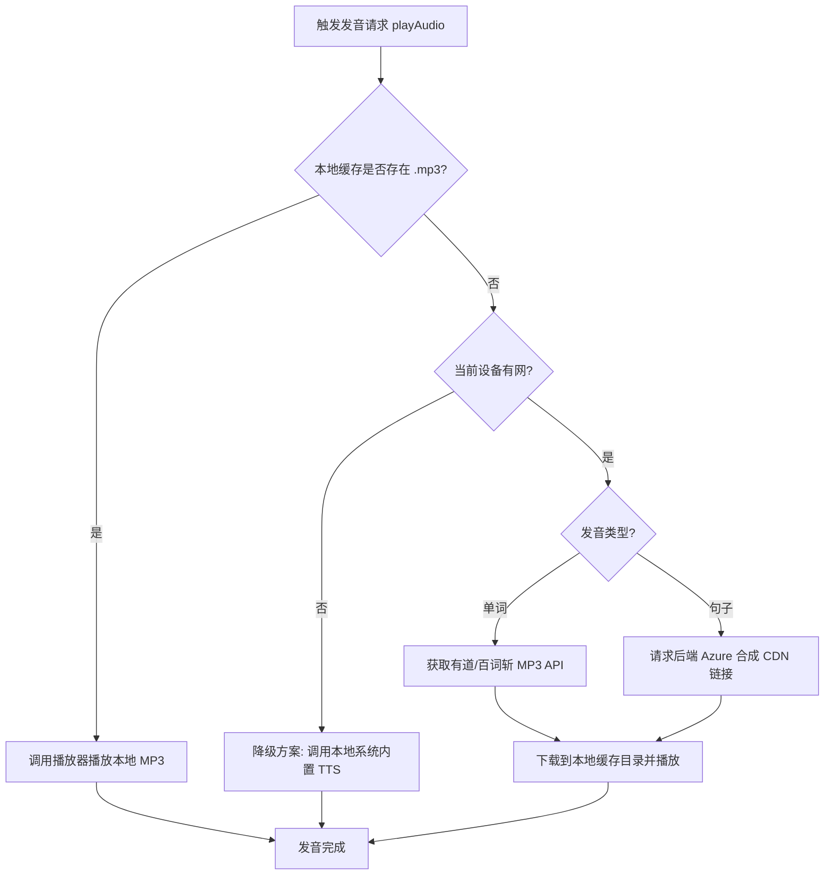

# 语音合成与发音系统研发设计文档 (Audio & Pronunciation System Design)

本技术设计文档定义了英语学习App中单词、句子和长文阅读的发音系统架构。该设计旨在为用户提供**流畅（延迟 <300ms）、逼真、地道（英音/美音）**的发音体验，同时在开发效率与云端带宽成本之间取得最佳平衡。

---

## 1. 业务背景与技术挑战

发音是英语学习体验中最高频的交互之一，贯穿于：
*   **单词卡片**：单词的拼写与音标朗读（支持英音/美音切换）。
*   **每日句子**：长句子的流式断句朗读。
*   **长文精读**：段落伴读、逐句音频播放与高亮。
*   **划词收藏**：即时气泡框划词发音。

**核心技术挑战**：
1.  **高音质与拟真度**：低劣的、电音感强的合成音会严重破坏用户背词和跟读的心流。
2.  **响应时延**：用户点击发音喇叭后，声音的播放延迟必须控制在 **300ms** 以内，任何明显的卡顿都会造成“卡片反应迟钝”的错觉。
3.  **弱网与离线支持**：背单词经常发生在地铁、公交等弱网甚至离线场景，发音服务需具备强大的本地降级与缓存机制。
4.  **服务器带宽与接口成本**：AI 生成接口（如 Azure neural voice）费用高昂，不能允许用户高频重复生成相同的句子音频。

---

## 2. 三阶段技术演进方案

为保证快速迭代，发音系统将分为三个阶段逐步推进：



### 2.1 第一阶段 (V1 MVP) - 完全本地离线
*   **核心策略**：完全依赖智能手机系统内置的 TTS 引擎。
*   **技术选型**：使用 Flutter 插件 `flutter_tts`。
*   **特点**：
    *   **开发成本**：极低（仅需集成插件）。
    *   **运营成本**：零。
    *   **用户体验**：iOS 设备表现尚可；安卓设备在缺失 Google TTS 引擎时发音效果较为机械、生硬。
    *   **网络要求**：100% 离线可用，响应时间极快（<100ms）。

### 2.2 第二阶段 (V2 混合云端) - 单词网络 API + 句子系统 TTS
*   **核心策略**：单词使用主流权威词典的公开免费发音 API，长句子和阅读维持系统内置 TTS 播放。
*   **单词发音 API 选型**（支持英音/美音）：
    *   *有道词典 API*：
        *   英音：`https://dict.youdao.com/dictvoice?audio={word}&type=1`
        *   美音：`https://dict.youdao.com/dictvoice?audio={word}&type=2`
    *   *百词斩发音源*：`https://media.reading.baicizhan.com/sound/{word}.mp3`
*   **缓存策略**：客户端首次加载单词发音时，异步下载该 MP3 并写入设备缓存目录，之后完全离线播放。
*   **体验升级**：单词听感极大提升，达到权威词典的真人朗读效果。

### 2.3 第三阶段 (V3 专业商用) - 神经网络 AI TTS + 全面 CDN 缓存
*   **核心策略**：单词采用自购标准高清词汇库；句子与文章段落接入 AI 神经网络 TTS 引擎，搭配“后端合成 + OSS/CDN 缓存”架构。
*   **AI 语音合成提供商**：**Microsoft Azure Neural TTS** (如 `en-US-JennyNeural` 音色)。
*   **全套链路设计**：
    1.  客户端发起句子发音请求。
    2.  自建 Node.js/Go 后端接收请求，首先计算句子的 `MD5(text + accent)`。
    3.  查询 Redis/云数据库，判断是否存在该 MD5 的音频文件。
        *   **是**：直接返回 CDN 加密分发链接。
        *   **否**：调用 Azure 接口生成 MP3，将其流式写入云存储（阿里云 OSS / 腾讯云 COS），生成 CDN 链接，更新 Redis，最后将 CDN 链接返回给客户端。
    4.  客户端下载并自动将其缓存至本地缓存目录。
*   **优点**：兼具完美的神经网络真人级发音（带有呼吸、连读和重音起伏）与低成本运作。

---

## 3. 客户端音频服务架构设计 (Audio Service Architecture)

在 Flutter 客户端，我们需要构建一个高可复用的 `AudioService`，该服务封装了发音源的选择逻辑与底层音频播放器。

### 3.1 核心数据流逻辑



---

## 4. 客户端实现细节与规范

### 4.1 核心依赖库选型
*   **系统 TTS 引擎**：`flutter_tts: ^4.0.0`（用于 V1 阶段及网络兜底）。
*   **音频解码与播放**：`audioplayers: ^6.0.0` 或 `just_audio: ^0.9.38`（用于播放本地与网络的 MP3 文件）。
*   **缓存存储与路径管理**：`path_provider: ^2.1.0`（用于获取沙盒缓存目录 `getTemporaryDirectory()`）。

### 4.2 本地缓存及清理策略 (LRU Cache)
为防止下载的音频文件无限期占用用户手机磁盘空间，须实施缓存控制管理：
1.  **命名规则**：统一采用小写，对发音文本和口音进行 MD5 哈希化命名：
    $$\text{FileName} = \text{MD5}(\text{lowercase}(text) + \text{accent}) + \text{".mp3"}$$
    *示例*：`abandon_uk` $\rightarrow$ `6af398...a7e.mp3`。
2.  **缓存限制**：设定缓存目录最大空间阈值为 **100MB**。
3.  **淘汰机制 (LRU)**：当新下载的文件导致缓存超出 100MB 时，按照**最后修改/访问时间**，从最旧的音频文件开始批量删除，直至缓存空间降至 80MB 以下。

---

## 5. 客户端伪代码与接口设计

```dart
enum AudioType { word, sentence }
enum VoiceAccent { uk, us }

abstract class AudioService {
  /// 播放指定文本的音频。
  /// 如果本地存在缓存则直接播放，否则网络请求/本地TTS降级。
  Future<void> play({
    required String text,
    required AudioType type,
    VoiceAccent accent = VoiceAccent.us,
  });

  /// 预加载音频（静默下载并存入本地缓存，例如当用户点击一篇文章时，提前下载各句音频）。
  Future<void> preload({
    required List<String> texts,
    required AudioType type,
    VoiceAccent accent = VoiceAccent.us,
  });

  /// 暂停当前播放
  Future<void> pause();

  /// 停止播放
  Future<void> stop();

  /// 设置播放语速 (0.8 ~ 1.5)
  Future<void> setSpeechRate(double rate);

  /// 清空所有发音缓存文件
  Future<void> clearCache();
}
```
