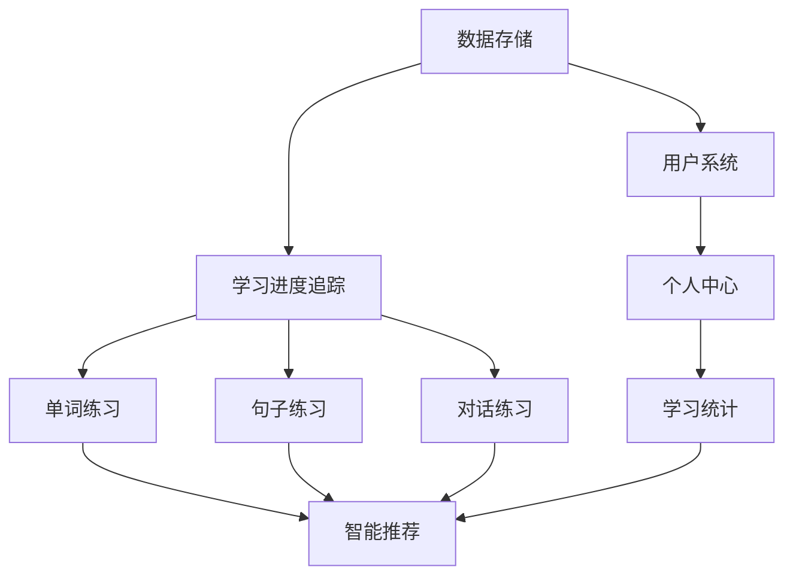

# 功能特性分解

## 📱 功能模块架构

### 核心模块 (4个主要标签)
```
英语学习App
├── 📖 阅读 (Reading)
├── 📝 练习 (Practice)  
├── 💬 对话 (Dialogue)
└── 👤 我 (Profile)
```

## 📖 阅读模块 (完成度: 85%)

### ✅ 已实现功能
#### 1. 文章管理系统
- **文章列表页面**
  - 卡片式文章展示
  - 难度等级标识 (初级/中级/高级)
  - 预计阅读时间显示
  - 文章标签分类系统
  - 搜索功能 (待实现)

- **文章详情页面**
  - 沉浸式阅读界面
  - 按句子分割显示
  - 中英文翻译切换
  - 阅读进度条
  - 字体大小调节

#### 2. 阅读体验功能
- **个性化设置**
  - 字体大小调节 (12-24px)
  - 中英文翻译切换
  - 进度自动保存

- **内容展示**
  - 文章难度标识
  - 阅读时间估算
  - 文章标签系统

### 🚧 待优化功能
#### 3. 高级阅读功能
- **文章管理**
  - [ ] 文章收藏功能
  - [ ] 阅读历史记录
  - [ ] 阅读笔记功能
  - [ ] 文章分享功能

- **个性化体验**
  - [ ] 深色主题支持
  - [ ] 自定义主题颜色
  - [ ] 阅读背景音乐
  - [ ] 专注模式

#### 4. 智能功能
- **推荐系统**
  - [ ] 基于难度的文章推荐
  - [ ] 阅读历史分析
  - [ ] 个性化学习路径

- **离线支持**
  - [ ] 文章离线下载
  - [ ] 离线阅读模式
  - [ ] 离线进度同步

## 📝 练习模块 (完成度: 20%)

### ✅ 已实现功能
#### 1. 练习中心首页
- **练习分类导航**
  - 2x2 网格布局
  - 四大练习类型入口
  - 卡片式设计
  - 统一视觉风格

### 🚧 开发中功能
#### 2. 单词练习子模块
- **基础练习功能**
  - [ ] 单词卡片显示 (正面英文，反面中文)
  - [ ] 单词测试模式
    - 英译中练习
    - 中译英练习
    - 听音识词
  - [ ] 单词发音播放

- **学习管理**
  - [ ] 单词收藏系统
  - [ ] 生词本管理
  - [ ] 复习计划 (基于遗忘曲线)
  - [ ] 学习进度统计

#### 3. 句子练习子模块
- **语法练习**
  - [ ] 句子填空练习
  - [ ] 句子排序练习
  - [ ] 语法错误纠正
  - [ ] 时态练习

- **表达能力**
  - [ ] 句子翻译练习
  - [ ] 句子仿写练习
  - [ ] 语法结构分析
  - [ ] 句型归纳

#### 4. 听力练习子模块
- **听力训练**
  - [ ] 听力材料播放
  - [ ] 听力理解测试
  - [ ] 听写练习
  - [ ] 语速调节

### 📋 计划功能
#### 5. 高级练习功能
- **智能评估**
  - [ ] AI自动评分
  - [ ] 错误原因分析
  - [ ] 学习建议生成

- **练习管理**
  - [ ] 练习计划制定
  - [ ] 练习记录查看
  - [ ] 错题集管理
  - [ ] 练习难度自适应

## 💬 对话模块 (完成度: 0%)

### 📋 待开发功能
#### 1. 对话场景系统
- **场景库建设**
  - [ ] 日常对话场景 (购物、问路、餐厅等)
  - [ ] 商务对话场景 (会议、谈判、面试等)
  - [ ] 学术对话场景 (讨论、演讲、答辩等)
  - [ ] 旅游对话场景

- **角色系统**
  - [ ] 多角色选择
  - [ ] 角色性格设定
  - [ ] 对话角色切换
  - [ ] 角色对话历史

#### 2. 交互练习功能
- **角色扮演**
  - [ ] 实时对话模拟
  - [ ] 对话选项选择
  - [ ] 对话分支路径
  - [ ] 对话结果评估

- **录音与评分**
  - [ ] 对话录音功能
  - [ ] 发音对比分析
  - [ ] 流利度评分
  - [ ] 语调评估

#### 3. 学习辅助
- **对话分析**
  - [ ] 表达方式分析
  - [ ] 词汇使用统计
  - [ ] 语法错误识别
  - [ ] 表达建议

- **进度管理**
  - [ ] 对话完成度追踪
  - [ ] 学习目标设定
  - [ ] 对话历史记录
  - [ ] 能力成长曲线

## 👤 个人中心模块 (完成度: 0%)

### 📋 待开发功能
#### 1. 用户信息管理
- **基础信息**
  - [ ] 用户头像上传
  - [ ] 昵称和个人信息
  - [ ] 学习背景设置
  - [ ] 学习目标设定

- **账户管理**
  - [ ] 登录注册功能
  - [ ] 密码修改
  - [ ] 账户安全设置
  - [ ] 数据备份恢复

#### 2. 学习统计系统
- **数据可视化**
  - [ ] 学习时长统计
  - [ ] 阅读量统计图表
  - [ ] 练习完成度分析
  - [ ] 各模块进度对比

- **成就系统**
  - [ ] 学习里程碑设置
  - [ ] 成就徽章收集
  - [ ] 学习排行榜
  - [ ] 学习证书生成

#### 3. 设置中心
- **应用设置**
  - [ ] 通知设置
  - [ ] 字体主题设置
  - [ ] 语言切换 (中文/英文)
  - [ ] 数据同步设置

- **学习设置**
  - [ ] 每日学习目标
  - [ ] 提醒时间设置
  - [ ] 难度级别调整
  - [ ] 学习模式选择

## ⚙️ 系统功能模块 (完成度: 0%)

### 📋 待开发功能
#### 1. 数据管理
- **本地存储**
  - [ ] SQLite数据库设计
  - [ ] 用户数据本地存储
  - [ ] 离线数据缓存
  - [ ] 数据备份恢复

- **云端同步**
  - [ ] 用户认证系统
  - [ ] 云端数据同步
  - [ ] 多设备数据同步
  - [ ] 离线数据合并

#### 2. 系统服务
- **AI服务集成**
  - [ ] AI翻译服务
  - [ ] 语音识别功能
  - [ ] 发音评分服务
  - [ ] 智能推荐算法

- **外部服务**
  - [ ] 第三方词典API
  - [ ] 语音合成服务
  - [ ] 数据分析服务
  - [ ] 推送通知服务

#### 3. 性能优化
- **应用性能**
  - [ ] 启动速度优化
  - [ ] 内存使用优化
  - [ ] 网络请求优化
  - [ ] 图片加载优化

- **用户体验**
  - [ ] 响应式设计
  - [ ] 无障碍访问支持
  - [ ] 国际化多语言
  - [ ] 错误处理机制

## 📊 功能优先级矩阵

### 高优先级 (P0)
1. 单词练习基础功能
2. 句子练习基础功能
3. 本地数据存储
4. 个人中心基础功能

### 中优先级 (P1)
1. 对话练习基础功能
2. AI翻译服务集成
3. 云端数据同步
4. 学习统计系统

### 低优先级 (P2)
1. 高级AI功能
2. 社交分享功能
3. 主题个性化
4. 性能高级优化

## 🎯 功能依赖关系



---

**最后更新**: 2026年2月12日  
**维护者**: 开发团队