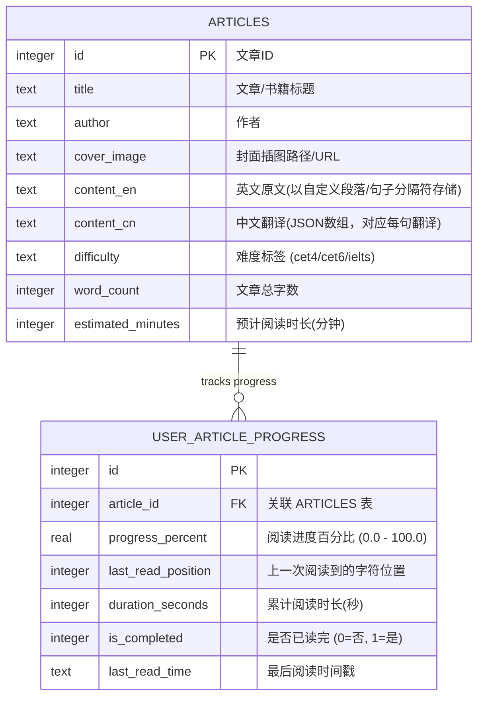

# 阅读模块 (Reading Module) 功能架构说明文档 (PRD)

本规划文档针对“英语学习App”的阅读模块进行架构与交互的深度重构。设计灵感来源于薄荷阅读、扇贝阅读以及不背阅读等业内标杆，旨在通过“沉浸式阅读”与“渐进式辅助”提升用户的外语阅读心流体验。

---

## 1. 设计理念与核心痛点

*   **痛点一：界面干扰过多，破坏阅读专注度。**
    *   *方案*：去除阅读详情页顶部常驻的字体缩放等繁琐控件。将排版标准化，让用户进入纯净的文本世界。
*   **痛点二：翻译依赖。**
    *   *方案*：拒绝粗暴的“全篇双语对照”。引入**句子级按需译文**，只有用户对某句有疑问并主动点击时，才在句下优雅呈现译文。
*   **痛点三：划词查询不便。**
    *   *方案*：轻量级**气泡弹窗（Popover）**。点击单词瞬间在上方浮现音标、简析与收藏键，不跳转、不弹遮罩，保护阅读心流。
*   **痛点四：列表枯燥。**
    *   *方案*：精美的**立体书本插图与卡片式流**，结合优雅的阅读进度条，营造类似于 Kindle 或实体书架的仪式感。

---

## 2. 阅读列表页设计 (Bookcase & Feed Flow)

列表页承载了用户的阅读兴趣激发，设计注重视觉的丰富度与品质感。

```
+--------------------------------------------+
|  [ 搜索文章或书籍... ]                      |
|                                            |
|  🔔 推荐阅读                               |
|  +--------------------+ +----------------+ |
|  |     [ 书籍封面 ]    | |   [ 书籍封面 ]   | |
|  |   The Little Prince| |   Sherlock     | |
|  |    🟢 65% Completed| |    ⚪ 0% Started| |
|  +--------------------+ +----------------+ |
|                                            |
|  📚 分级阅读 (Reading Level)                |
|  [全部]  [CET-4]  [CET-6]  [雅思]  [经典名著] |
|                                            |
|  📰 今日精选文章                            |
|  +---------------------------------------+ |
|  | [插图]  Why Sleep Matters              |
|  |         Sleep is essential for health. |
|  |         ⏱️ 5 mins read  🏷️ CET-4        |
|  +---------------------------------------+ |
+--------------------------------------------+
```

### 2.1 视觉要素与布局
*   **网格书籍流 (Book Grid)**：针对长篇名著或连载小说，采用 3D 立体拟真图书封面（包含精美彩色插画与阴影），右下角附带圆形进度环（如 `65%`）。
*   **列表文章流 (Article Card)**：针对短篇新闻或美文，采用横向扁平卡片布局。左侧为精致的文章主题插图，右侧为文章标题、简要导语、难度标签（如 `CET-6`）和预估阅读时长（如 `8 mins read`）。
*   **骨架屏加载动效**：在加载数据时，显示淡灰色扫光骨架图，模拟书本和段落排版，提供顺滑的过渡体验。

---

## 3. 阅读详情页交互设计 (Immersive Reader)

详情页遵循 **“温润极简 (Warm Minimalism)”** 规范，采用淡米色（#F7F3EB）或护眼绿（#E8F0E8）作为阅读背景底色，保护视力。

### 3.1 界面去冗余化
*   **剔除常驻字号按钮**：顶部操作栏仅保留 [返回] 和 [加入生词本/收藏文章] 图标。
*   **系统自适应最佳排版**：采用黄金行高（1.6x 字符高度）和字距，默认提供最符合人体工学的 16dp 衬线字体（Serif，如 Georgia / Playfair Display），以利于长文阅读。
*   **隐藏设置面板**：若用户确实想修改字号或背景色，需点击右上角「...」更多按钮，从底部滑出轻量设置抽屉（BottomSheet），避免污染主阅读界面。

### 3.2 单词点击气泡释义 (Word Popover)
*   **极速响应**：用户轻触文章中的任意单词，该单词背景呈柔和灰色高亮，且在单词正上方/正下方立即浮现半透明气泡弹窗。
*   **不阻断设计**：气泡使用毛玻璃材质（BackdropFilter），不弹出整页 Dialog，点击文章任意其他位置，气泡即自动隐去。
*   **气泡内功能**：
    1.  **英文拼写与音标**（提供英/美音标发音喇叭）。
    2.  **简明中文释义**（仅展示最常用的 1-2 个词性及中文含义，避免信息过载）。
    3.  **[➕ 收藏] 按钮**：点击直接加入生词本，并**自动绑定该单词在文章中所在的整句作为上下文例句**。

```
       +----------------------------+
       | abandon /ə'bændən/      🔊 |
       | vt. 放弃，遗弃，放任       |
       |                   [➕ 生词本] |
       +-------------v--------------+
  They were forced to abandon the ship.
```

### 3.3 句子级按需翻译 (Sentence-Level Translation)
为了引导用户养成英文思维，默认关闭所有中文翻译，仅在句子级别提供可选交互。

*   **疑问辅助按钮**：
    *   在每个英文句子的末尾，提供一个极细、低饱和度的半透明灰色的 **“译”** 或 **“?”** 图标。
    *   或者，当用户**长按某句话**时，触发该句子的选择状态。
*   **无缝动态展开**：
    *   点击“译”字图标后，该图标旋转并变为高亮的激活色，对应的中文译文以平滑的滑出动画（Slide Fade）**直接展示在英文句子的下方**。
    *   译文采用略小一号的淡灰色无衬线字体，与正文英文形成明显的视觉层级，防止干扰视线。
    *   再次点击该图标，译文折叠收起。

```
  They were forced to abandon the ship because of the storm. [译]
  他们因为暴风雨而不得不弃船。
  The passengers were saved by a passing rescue boat. [译]
```

### 3.4 语音伴读与音频控制 (Audio Accompaniment - 暂定)
在顶部或底部提供悬浮的迷你音频播放器。
*   **播放控制**：包含播放/暂停、语速调节（0.8x 至 1.5x）、逐句快进/快退。
*   **卡拉OK式逐句高亮**：
    *   当音频播放时，正文中正在朗读的句子会自动添加一个淡黄色/淡绿色的半透明背景色，并自动滚动屏幕以确保该句始终在屏幕中央。
    *   用户点击文章中的任意句子，音频播放进度条会自动跳转到该句子的起点开始播放。

---

## 4. 数据库设计 (Database Schema)

阅读模块的本地 SQLite 数据表设计如下，以支持进度追踪和个性化生词关联。



---

## 5. 创新联动：背词与阅读的双向打通

阅读模块的终极价值在于与单词模块建立闭环：
*   **阅读中划词** $\rightarrow$ 存入生词本（自动抓取该段落句子作为该生词的例句）。
*   **背诵该生词时** $\rightarrow$ 卡片背面展示“来自您阅读的文章：《Why Sleep Matters》中的句子”，唤醒情境记忆。
*   **文章再次出现该词时** $\rightarrow$ 文章中的该单词自动带有微弱的下划线（或虚线），提示用户这是他们背过的生词，帮助他们在实际阅读语境中进行二次复习与巩固。
