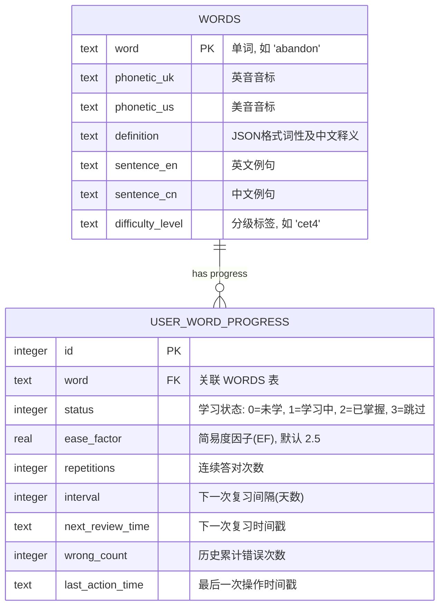

# 单词模块 (Word Module) 功能架构说明文档 (PRD)

本规划文档针对“英语学习App”的单词模块进行详细的架构和功能设计。本设计参照了墨墨背单词、百词斩、不背单词等业界标杆，并结合了“温润极简 (Warm Minimalism)”的界面风格与操作效率创新。

---

## 1. 产品定位与核心目标

*   **极简高效**：界面干净，排除干扰信息，聚焦词汇记忆的核心心流。
*   **低认知负荷**：采用创新的“手势+快速标记”机制，降低用户选择和确认的决策成本。
*   **抗遗忘记忆**：引入自适应的间隔重复算法（基于 SM-2），动态调配新词与复习词的比例。

---

## 2. 本地词库与存储设计

为了平衡应用的首次下载体积、离线可用性以及丰富的数据内容，词库数据存储方案设计如下：

### 2.1 本地 SQLite 默认预置词库
*   **预置规模**：默认在本地 SQLite 中预置 **3,000 个最常用高频核心词汇**（覆盖小学、初中、高中、大学四级核心高频词）。
*   **预置内容**：每个单词包含拼写、标准国际音标（英/美）、基础中文释义（2-3个核心词义）、1条精选双语例句、以及压缩后的高清发音音频（或直接使用系统 TTS 发音以进一步降低包体体积）。
*   **包体积控制**：控制默认数据库在 **10MB** 以内，保证开箱即用，无需网络即可打通“新用户首日背词”体验。

### 2.2 离线词库的按需加载与同步
*   **词库分级隔离**：在数据库中将词库分为“通用核心库”与“扩展专业库”。
*   **按需同步 (On-Demand Loading)**：
    *   当用户切换到“雅思”、“托福”、“考研”等高阶词库时，若检测到本地无数据，系统引导用户在联网状态下一键下载该词库包（大小约 5-15MB ）。
    *   下载后采用增量写入（Bulk Insert）方式并入本地 SQLite，写入完成后即可完全离线使用。

### 2.3 数据库关键表设计概要



---

## 3. 单词分级体系 (Word Leveling System)

支持用户根据所处阶段和学习目标，自由选择和切换词库。

| 等级分类 | 覆盖词库 | 建议词汇量 | 目标人群 |
| :--- | :--- | :--- | :--- |
| **基础入门** | 小学核心词库 / 初中核心词库 | 800 / 1,600 | 零基础、K12、夯实基础阶段用户 |
| **实用进阶** | 高中高考词库 / 大学四级 (CET-4) | 3,500 / 4,500 | 高中生、非英语专业大学生、日常沟通 |
| **高级学术** | 大学六级 (CET-6) / 考研英语 (NETEM) | 5,500 / 5,500 | 英语水平进阶者、学术备考人员 |
| **国际备考** | 雅思 (IELTS) / 托福 (TOEFL) / GRE 核心 | 8,000 / 10,000 / 3,000 | 留学申请、外企求职、高阶词汇突破 |

### 3.1 词库切换交互
*   采用“书架/卡片”式界面，用户可以清晰看到各等级词库封面、总词数。
*   卡片底部提供环形进度条，展示当前词库的学习进度（`已掌握词数 / 词库总词数`）。

---

## 4. 核心交互创新：快速标记与手势流

为了突破传统“看英文 -> 想释义 -> 点看答案 -> 点认识/不认识”的繁琐流程，我们设计了一套**极速盲背与手势交互系统**，大幅度减少决策与点击延时。

### 4.1 四键快速分流（底部常驻）

在背词卡片呈现时，底部常驻 4 个高对比度的微彩色操作按钮：

```
+-------------------------------------------------------------+
|                                                             |
|                          abandon                            |
|                        /ə'bændən/                           |
|                                                             |
|                        [发音喇叭]                           |
|                                                             |
+-------------------------------------------------------------+
|  [ 认识 ]     [ 模糊 ]       [ 不认识 ]      [ 太简单/跳过 ]|
|  (Green)      (Yellow)        (Red)           (Gray)        |
+-------------------------------------------------------------+
```

1.  **「 认识 」(Know) - 绿色**
    *   **适用场景**：用户一看即知其意。
    *   **系统响应**：触发淡绿色涟漪动效，不展示中文释义，直接切换到下一个单词。
    *   **算法影响**：该词熟练度（Repetitions）+1，下一次复习间隔 $Interval$ 翻倍增长。
2.  **「 模糊 」(Vague) - 黄色**
    *   **适用场景**：有印象，但一时想不起确切含义，或发音/拼写不确定。
    *   **系统响应**：触发淡黄色微动效。**不立即展示答案**，而是提供**首字母提示**或**例句遮挡（挖空）**提示，给用户 3 秒的二次思考缓冲。再次点击屏幕任意位置，展开中文释义。
    *   **算法影响**：该词进入今日的“模糊巩固队列”，在当前背词组结束前会再次出现 1 次。
3.  **「 不认识 」(Don't Know) - 红色**
    *   **适用场景**：完全陌生，或记忆完全错误。
    *   **系统响应**：触发红色警告微震动，自动播放标准发音，并**瞬间展开详尽的单词解释卡片**（包含：多重中文释义、助记词根、情景图片、双语例句）。
    *   **算法影响**：将该词的简易度因子（Ease Factor）调低，熟练度归零。该词将被强制插入到当前学习组的第 `N+3` 和 `N+7` 的位置，进行瞬时重复强化。
4.  **「 太简单/跳过 」(Too Easy) - 灰色**
    *   **适用场景**：如 "apple", "hello" 等用户早已刻骨铭心的单词。
    *   **系统响应**：提示“已将该词永久剔除”。
    *   **算法影响**：将该词标记为 `status = 3 (跳过)`，在当前词库中永久屏蔽，不再出现在每日学习和复习队列中，但在词汇量统计中仍算作“已掌握”。

### 4.2 卡片全屏手势支持 (Gesture Mode)
支持单手模式下的全屏滑动手势操作，使用户在地铁、公交等单手场景下也能高效复习：
*   **右滑 (Swipe Right)** $\rightarrow$ 标记为「 认识 」，直接切换下一张。
*   **左滑 (Swipe Left)** $\rightarrow$ 标记为「 不认识 」，展开详细释义。
*   **下滑 (Swipe Down)** $\rightarrow$ 标记为「 模糊 」，显示微弱提示。
*   **上滑 (Swipe Up)** $\rightarrow$ 标记为「 太简单 」，弹窗二次确认后跳过。

---

## 5. 单词练习呈现与算法引擎

单词呈现逻辑并非单纯的“随机”，而是结合了“新词引入”、“遗忘曲线”和“错题生词”的多维度智能混合。

### 5.1 练习队列智能混合机制
每日生成的背词列表（例如设定每日 30 个词）应按照以下比例智能配比：
*   **新词导入 (30%)**：当前选定词库中未开始学习的单词。
*   **曲线复习 (50%)**：根据 SuperMemo SM-2 算法计算，今天“刚好到达遗忘临界点”的单词。
*   **生词巩固 (20%)**：用户在之前的阅读、听力中手动添加的生词，或近期答错率极高的“顽固词”。

### 5.2 SM-2 记忆算法的改进应用
针对英语记忆的特点，对经典 SM-2 算法进行参数微调：
*   **熟练度评分 (Response Quality, $q$)** 映射：
    *   「太简单」 $\rightarrow q = 5$
    *   「认识」且反应时间 < 1.5秒 $\rightarrow q = 4$
    *   「认识」但反应时间 $\ge$ 1.5秒 $\rightarrow q = 3$
    *   「模糊」 $\rightarrow q = 2$
    *   「不认识」 $\rightarrow q = 1$
*   **简易度因子 (Ease Factor, $EF$) 计算**：
    $$EF' = EF + (0.1 - (5 - q) \times (0.08 + (5 - q) \times 0.02))$$
    若 $EF' < 1.3$，则强制设定 $EF' = 1.3$。
*   **复习间隔 (Interval, $I$) 计算**：
    *   $I(1) = 1$ 天
    *   $I(2) = 3$ 天
    *   $I(3) = 7$ 天
    *   对于 $n > 3$: $I(n) = I(n-1) \times EF$
    *   若用户标记「不认识」 ($q < 3$)，则间隔重置：$I = 1$，重新开始计算周期。

---

## 6. 创新辅助功能规划

### 6.1 生词本“消灭战”关卡 (Smart Notebook Clean-up)
*   **机制**：将用户收藏的生词、测试中的错词，按照熟练度排列。
*   **消灭规则**：开启“消灭模式”，用户必须在非同一组的连续 3 次复习中，对该生词标记「认识」（且无模糊提示），该生词才会被移出生词本并归入已掌握。
*   **激励**：每消灭 20 个生词，奖励专属的“消灭徽章”，并在能力雷达图的“词汇量”分支上给予额外加分。

### 6.2 桌面锁屏与快捷背词小部件 (Widgets)
*   **功能**：在手机桌面（iOS Widget / Android Widget）提供一个“每日 5 词”卡片。
*   **交互**：无需打开应用，在桌面上即可直接点击喇叭发音，点击卡片翻转显示释义，或点击“认识/不认识”快速完成零碎时间的单词温习。

### 6.3 语境带入：划词一键收藏
*   当用户在“每日阅读”或“每日句子”模块中阅读文章时，长按/双击任意单词，系统弹出极简气泡框显示音标与简义。
*   点击气泡中的“收藏”按钮，该单词将自动与当前语境的例句绑定，写入 SQLite 生词本，并在背词模块中优先呈现，提供原文章上下文助记。
