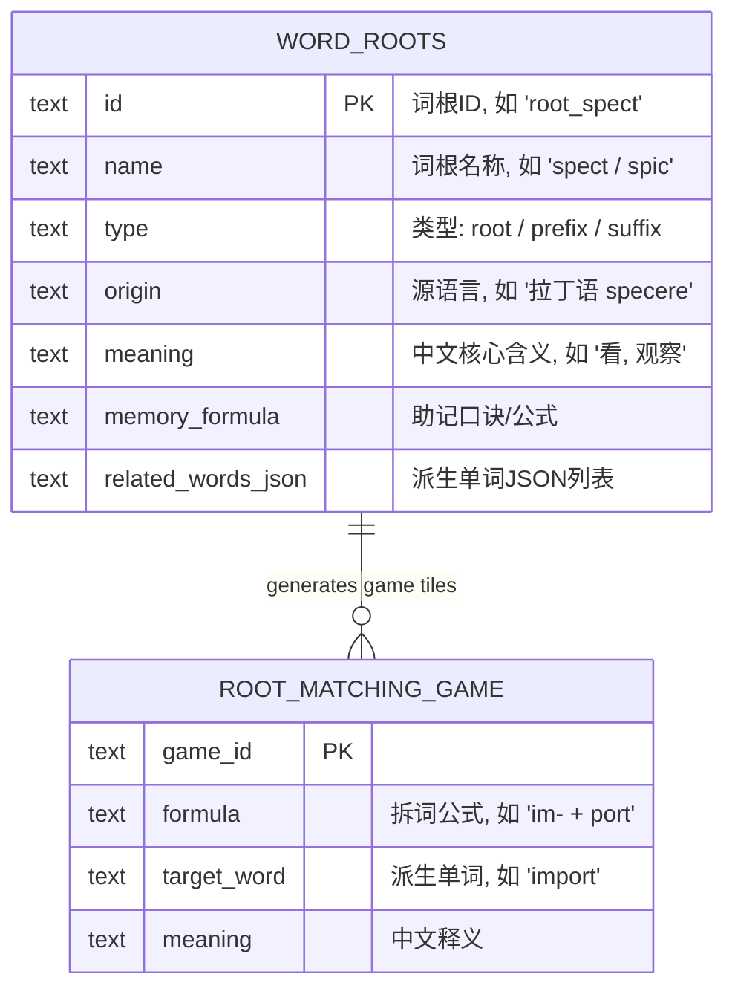

# 字词根专项训练模块 (Word Roots Module) 产品需求文档 (PRD)

本规划文档针对“Lumina English”的字词根专项训练模块（Word Roots & Affixes Module）进行详细的功能架构与产品交互设计。基于词源学（Etymology）解构逻辑，帮助用户通过“前缀 + 词根 + 后缀”建立成体系的词汇衍生网络，提升背词效率与构词记忆。

---

## 1. 产品定位与核心目标

*   **词源拆解**：通过拉丁语与希腊语高频词根、前缀、后缀，剖析单词底层逻辑。
*   **网络化思维**：拒绝单词孤立记忆，通过“派生思维导图树”可视化呈现一根多词的同根词族（Word Families）。
*   **寓教于乐**：提供“拆词连线消消乐”游戏，通过公式配对增强词根构词的互动乐趣。
*   **搜索与联动**：支持词根词缀快捷检索搜索框与分类筛选，并与生词本和单词练习打通。

---

## 2. 模块功能架构

```
+-------------------------------------------------------------------+
|                   字词根专项训练 (Word Roots Hub)                  |
+-------------------------------------------------------------------+
|  [ 🔍 搜索词根/前缀/后缀 (如 'spect', 'im-', 'able')... ]          |
|                                                                   |
|  [ 核心词根 ]   [ 高频前缀 ]   [ 常用后缀 ]   [ 派生树 ]   [ 连线游戏 ]|
+-------------------------------------------------------------------+
|                                                                   |
|  Tab 1: 核心词根 (Roots)                                           |
|  - 展开卡片展示: 语源含义、助记口诀、派生词汇表与原声发音          |
|                                                                   |
|  Tab 2 & 3: 高频前缀 / 常用后缀 (Prefixes & Suffixes)              |
|  - 方向/否定/程度前缀, 词性转换后缀分类解构                       |
|                                                                   |
|  Tab 4: 派生思维导图树 (Mind Map Tree)                              |
|  - 核心 Node (如 'struct') ➔ 衍生词节点 (structure, destroy...)   |
|                                                                   |
|  Tab 5: 拆词连线游戏 (Matching Game)                              |
|  - 拆词公式 vs 中文释义消消乐, 大满贯结算与 LP 积分奖励           |
+-------------------------------------------------------------------+
```

---

## 3. 核心功能与交互规范

### 3.1 词根词缀分类库与搜索 (Search & Filter)
*   **实时搜索过滤**：顶栏搜索框输入拼写（如 `spect`）或含义（如 `看、观察`），实时过滤下方词根与词缀卡片。
*   **词根卡片 ExpansionTile**：
    *   **Header**：显示词根名称（如 `spect / spic`）、中文通义（如 `看、观察`）、源语言标记（`[拉丁语 specere]`）。
    *   **Body**：展示助记公式、例词列表（英文、音标、发音播放按钮、中文释义以及一键加入生词本）。

### 3.2 派生思维导图树 (Mind Map Tree View)
*   **中心词根节点**：突出显示核心 Root（如 `form` 形状 / `script` 书写）。
*   **前缀分支与词性衍生**：分层展示 `con- + form` $\rightarrow$ `conform` (符合)；`trans- + form` $\rightarrow$ `transform` (变形)。
*   **节点互动发音**：点击衍生词节点播放原声朗读，并显示该词在词根网络中的位置。

### 3.3 拆词连线消消乐游戏 (Interactive Matching Game)
*   **游戏机制**：左侧为拆词公式（如 `sub- [在…下] + way [路]`），右侧为中文释义（如 `地铁`）。
*   **匹配规则**：依次点击左侧与右侧卡片，匹配成功触发绿光与成功发音，消除该对卡片；匹配错误触发微抖动。
*   **大满贯结算**：全消除后弹窗结算成绩，颁发 100 LP 积分奖励。

---

## 4. 数据库与数据模型设计 (Data Model)



---

## 5. 验收标准 (Acceptance Criteria)

1. **搜索过滤**：在字词根列表页输入关键字，能秒级筛选出匹配的词根/前缀/后缀。
2. **完整性**：包含至少 30 组高频 Latin/Greek 核心词根与词缀。
3. **互动与消除**：连线消消乐游戏逻辑无死锁，消除正确伴有高保真音频，大满贯时成功弹窗。
4. **静态检查**：代码无 Flutter/Dart analyzer 警告。
